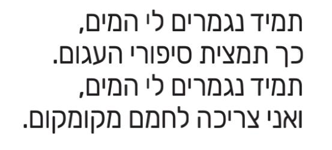
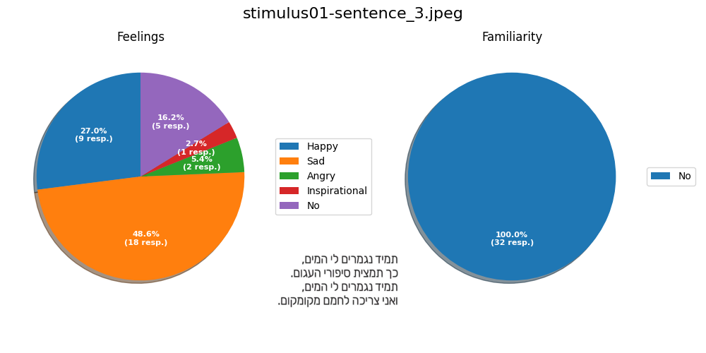

# White Noise fMRI stimuli labeling exp. #
## Repo description: ##
* ###  repo_dir/
  * ###  code/ ###
        Code used to generate plots to describe subjects` responses.
  * ### responses/ ###
        .png files containing pie charts that describe subjects` responses to stimuli.
  * ### stimuli/ ###
        All stimuli used for the labeling procedure.
  * ### Stimuli labeling for fMRI task.csv ###
        Original .csv file as extracted from google forms.

## Response example ##
response for stimulus01 (sentence_3.jpeg):

The stimulus: 
>Stimulus can be found at './stimuli/sentece_3.jpeg'

Subjcets` responses:
>Stimulus can be found at './responses/stimulus01-sentence_3.jpeg.png'

